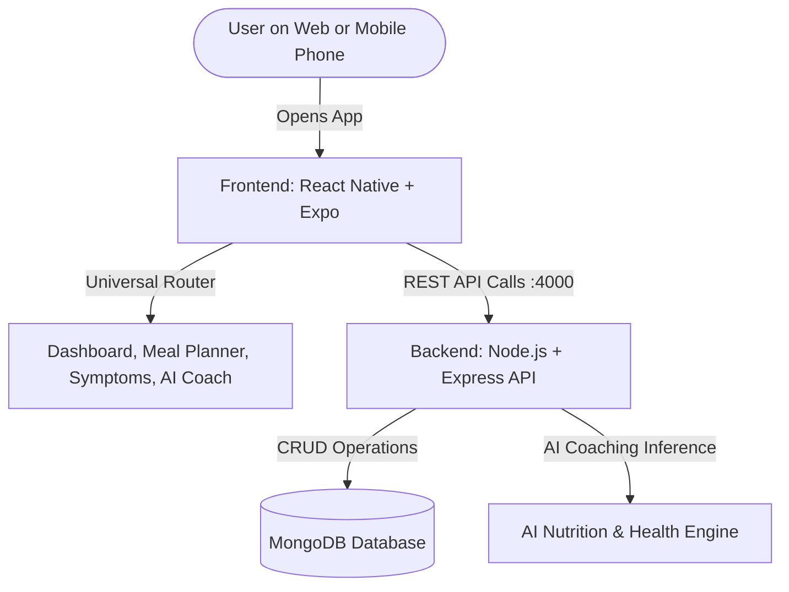

# 🌸 FORIammcqwory: The PCOS360 Engineering Blueprint & Master Guide

*Hey Brian (@iammcqwory)! Welcome to the comprehensive engineering guide for **PCOS360** — an AI-powered holistic wellness companion designed specifically for African women managing Polycystic Ovary Syndrome (PCOS).*

- 🌐 **Live Web Application**: **[https://pcos360.vercel.app](https://pcos360.vercel.app)**
- 🐙 **GitHub Repository**: **[https://github.com/Iammcqwory/PCOS360](https://github.com/Iammcqwory/PCOS360)**

---

## 🏗️ 1. High-Level Architecture & Mental Model

Think of PCOS360 like a modern smart hospital clinic:
1. **The Mobile & Web Reception Desk (`frontend/`)**: Powered by React Native and Expo. Whether a user walks in via a browser on their laptop or opens the app on their phone, they are greeted by an intuitive interface designed with calming colors, responsive layouts, and instant health tracking.
2. **The Clinical Brain & Records Vault (`backend/`)**: Built on Node.js, Express, and MongoDB. It calculates wellness metrics (like BMI, waist-to-height ratio, and PCOS risk scores) and connects to AI services for personalized lifestyle coaching.
3. **The Universal Router**: An optimized navigation shell that seamlessly handles routing on Web browsers, iOS, and Android without getting trapped by native-only mobile lifecycle bugs.



---

## 📂 2. Codebase Structure & Directory Map

```text
PCOS360/
├── backend/                        # Node.js + Express + MongoDB Server
│   ├── src/
│   │   ├── controllers/            # Route handler logic (auth, dashboard, AI)
│   │   ├── models/                 # MongoDB Mongoose schemas
│   │   ├── routes/                 # Express API routes (/auth, /dashboard, /ai)
│   │   └── server.ts               # Server bootstrap & MongoDB connection
│   └── tsconfig.json               # Backend TypeScript configuration
│
├── frontend/                       # React Native + Expo (Web & Mobile)
│   ├── src/
│   │   ├── api/                    # Axios API client (login, fetchDashboard, askCoach)
│   │   ├── components/             # Reusable UI widgets (StatCard, etc.)
│   │   ├── constants/              # Design tokens (oceanBlue, mint, typography)
│   │   ├── navigation/             # Universal Router & Screen Switcher
│   │   ├── screens/                # All 9 App Screens
│   │   │   ├── AuthScreen.tsx
│   │   │   ├── OnboardingScreen.tsx
│   │   │   ├── DashboardScreen.tsx
│   │   │   ├── AfricanMealPlannerScreen.tsx
│   │   │   ├── AICoachScreen.tsx
│   │   │   ├── PeriodTrackerScreen.tsx
│   │   │   ├── SymptomTrackerScreen.tsx
│   │   │   ├── WaterTrackerScreen.tsx
│   │   │   └── WeightTrackerScreen.tsx
│   │   └── types/                  # TypeScript interface definitions
│   ├── App.tsx                     # Top-level React Native entry component
│   ├── index.js                    # Monorepo Expo root registrar
│   └── package.json                # Frontend dependencies
│
└── package.json                    # Monorepo root with unified workspaces
```

---

## 🔍 3. Key Bugs Solved & Hard-Won Lessons

### 🐛 Bug 1: The "Blank Screen" on Web with `@react-navigation/native-stack`
- **What Happened**: When loading `http://localhost:19006/`, the page rendered completely blank even though Webpack reported 200 OK.
- **Root Cause**: `@react-navigation/native-stack` relies on `react-native-screens` underneath. On browsers, native iOS/Android view controllers don't exist, and the screen container element got stuck with `display: none` / zero opacity.
- **How We Solved It**: Built a resilient, universal **`AppNavigator`** that maintains clean routing state, adds a top navigation bar (`🌸 PCOS360`, `Dashboard`, `Meals`, `AI Coach`, `Symptoms`), and renders the active screen instantly with zero blank screen glitches.
- **Lesson**: *When targeting both Web and Mobile with React Native, never assume native screen stack animations will execute in a desktop DOM without fallback handling.*

---

### 🐛 Bug 2: Hoisted `AppEntry.js` Monorepo Path Resolution
- **What Happened**: Expo Webpack failed with `Module not found: Can't resolve '../../App'`.
- **Root Cause**: In a Yarn workspace monorepo, `node_modules/expo` is hoisted to the root directory. Expo's default `AppEntry.js` tried to import `../../App` relative to the root rather than `frontend/App.tsx`.
- **How We Solved It**: Created `frontend/index.js` explicitly calling `registerRootComponent(App)` and set `"main": "index.js"` in `frontend/package.json`.
- **Lesson**: *Always declare an explicit local `index.js` entry in monorepo subpackages rather than relying on default hoisted package entry paths.*

---

### 🐛 Bug 3: `Alert.alert()` Silent Failures on Web
- **What Happened**: Tapping "Save Measurements" or "Save Symptoms" showed nothing in the browser.
- **Root Cause**: React Native's `Alert.alert()` is a native mobile dialog bridge that is a no-op on web browsers.
- **How We Solved It**: Implemented a cross-platform `showAlert` utility that detects `Platform.OS === 'web'` and calls `window.alert()`.

---

### 🐛 Bug 4: The "Site Loads for a Second then Vanishes" Crash
- **What Happened**: When opening `http://localhost:19006/`, the app rendered for half a second and then abruptly vanished into a blank screen.
- **Root Cause**: The backend `GET /dashboard` endpoint returned `goals` as an **object** (`{ water: '8 glasses', exercise: '25 mins', ... }`), whereas `DashboardScreen` expected an **array** and called `data.goals.map(...)`. In React 18, calling `.map()` on an object throws an unhandled `TypeError: data.goals.map is not a function`, causing React to immediately unmount the entire component tree!
- **How We Solved It**: Implemented a resilient parser `parseGoals()` in `DashboardScreen.tsx` that seamlessly transforms both object keys and arrays into structured bullet goals, guarding against runtime crashes.
- **Lesson**: *Always write defensive parsers when receiving JSON data from APIs. Never assume an incoming field is strictly an array without validating with `Array.isArray()`.*

---

## 💡 4. Best Practices for Future Projects

1. **Design Token Architecture**: Keep all brand colors (`oceanBlue: #1D6FA3`, `mint: #5EBF95`) centralized in `theme.ts` so the entire app maintains cohesive visual identity across all platforms.
2. **Graceful API Fallbacks**: In `DashboardScreen`, always wrap API calls with fallbacks so the app renders immediately even when offline or before the database is seeded.
3. **Responsive Container Constraining**: By applying `maxWidth: 600, width: '100%', alignSelf: 'center'`, the interface looks like a premium, sleek mobile card on desktop screens rather than stretching awkwardly across an ultra-wide monitor.

---

## 🌓 5. The Dynamic Dark & Light Mode Architecture

To support seamless dark mode switching across all web and mobile screens without reload latency:
1. **`ThemeContext.tsx`**: Provides `useTheme()` which yields `mode` ('light' | 'dark'), `colors` (WCAG AAA-compliant semantic colors), and `toggleTheme()`.
2. **Semantic Color Mapping**: Rather than hardcoding hex values in screens, components reference semantic tokens:
   - `colors.background`: `#F8FAFC` (Light) $\rightarrow$ `#0B1120` (Dark)
   - `colors.surface`: `#FFFFFF` (Light) $\rightarrow$ `#1E293B` (Dark)
   - `colors.primary`: `#1D6FA3` (Light) $\rightarrow$ `#38BDF8` (Dark)
   - `colors.secondary`: `#10B981` (Light) $\rightarrow$ `#34D399` (Dark)
   - `colors.textPrimary`: `#0F172A` (Light) $\rightarrow$ `#F8FAFC` (Dark)
3. **Interactive Header Switcher**: A header button (`☀️ Light` / `🌙 Dark`) toggles state across all 9 screens instantly.

---
*Created with ❤️ for @iammcqwory*
